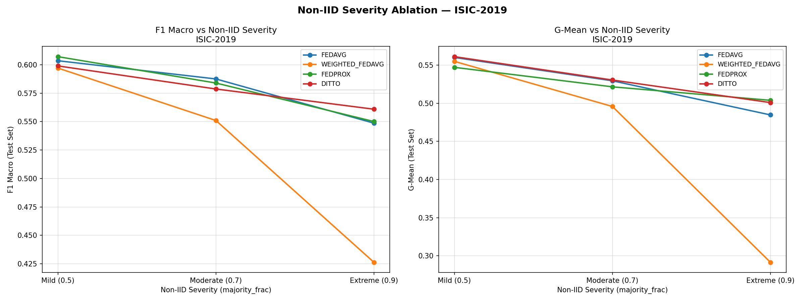
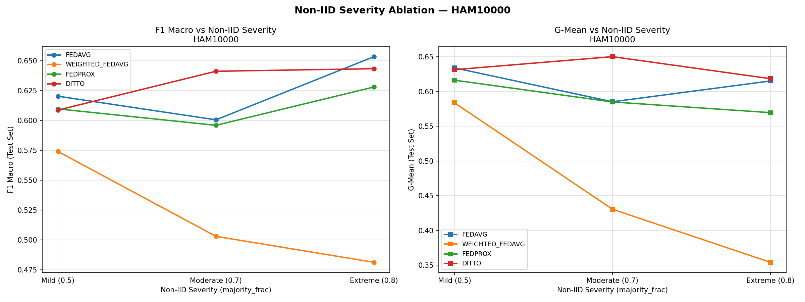
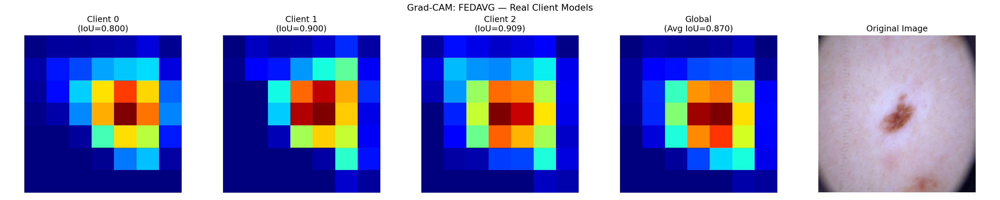
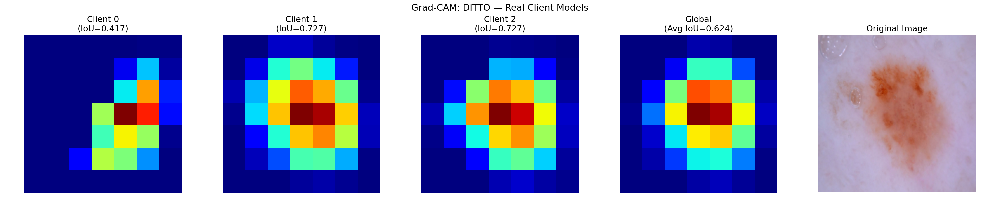
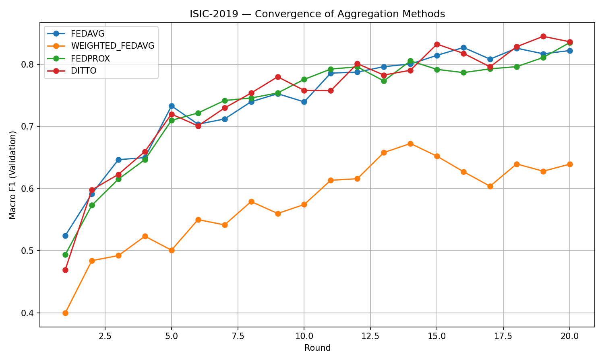
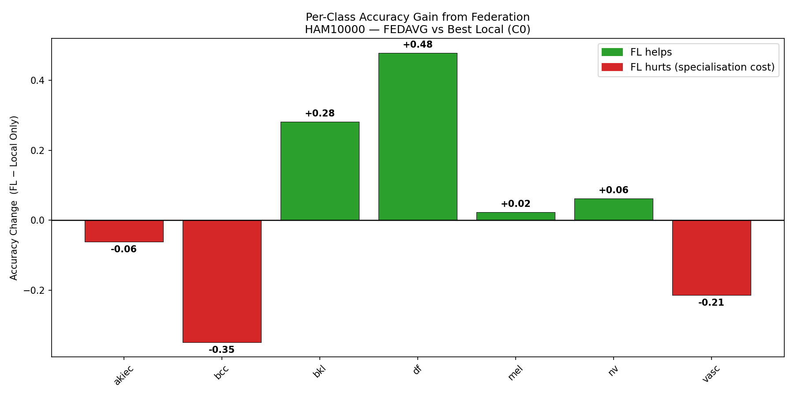
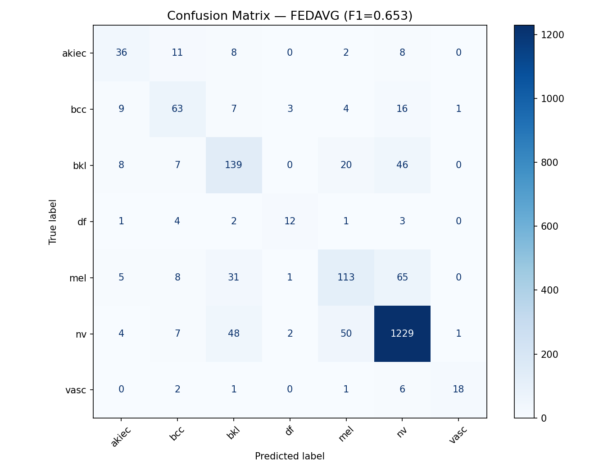
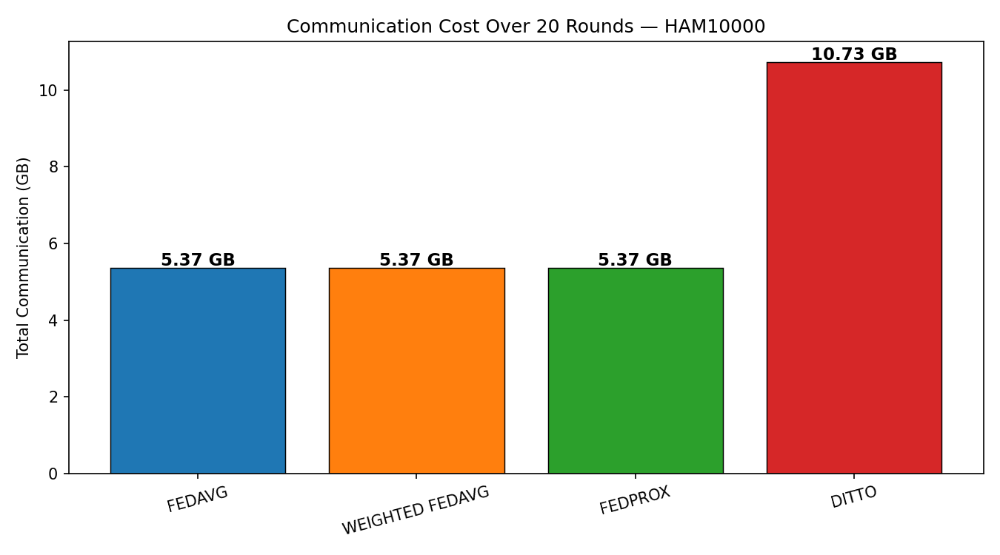

# Federated Learning for Skin Lesion Classification

### A Comparative Study Under Extreme Non-IID Class Imbalance

A complete, from-scratch federated learning pipeline comparing four aggregation strategies — **FedAvg**, **Weighted FedAvg**, **FedProx**, and **Ditto** — on two real-world dermoscopic image datasets, with a dedicated ablation on non-IID severity and full explainability analysis via Grad-CAM.

---

## Table of Contents

- [Overview](#overview)
- [Key Findings](#key-findings)
- [Results](#results)
- [Non-IID Severity Ablation](#non-iid-severity-ablation)
- [Explainability — Grad-CAM](#explainability--grad-cam)
- [Convergence](#convergence)
- [Per-Class Analysis](#per-class-analysis)
- [Communication Cost](#communication-cost)
- [Methodology](#methodology)
- [Project Structure](#project-structure)
- [How to Run](#how-to-run)
- [Limitations](#limitations)
- [Acknowledgements](#acknowledgements)
- [License](#license)

---

## Overview

Medical imaging data is siloed across hospitals due to patient privacy regulations, making centralized model training infeasible in most real clinical settings. **Federated Learning (FL)** allows multiple institutions to collaboratively train a shared model without ever exchanging raw patient data — only model weights are communicated.

A major open challenge in FL is **non-IID data**: in practice, different hospitals see different patient populations and different distributions of disease classes. This project simulates that scenario explicitly — each client is assigned a _majority_ set of lesion classes (mimicking a hospital that specializes in certain conditions), with the remaining samples distributed elsewhere.

This repository investigates:

1. How four FL aggregation strategies perform under **extreme** non-IID class imbalance
2. How that performance **degrades** as imbalance becomes more severe (ablation study)
3. What federation **costs and gains** on a per-class basis compared to local-only training
4. Whether federated models remain **explainable** — do client and global models attend to the same regions of an image?

**Datasets:** HAM10000 (7 lesion classes, ~10,000 images), ISIC-2019 (8 lesion classes, ~23,000 images)
**Aggregation methods:** FedAvg, Weighted FedAvg, FedProx, Ditto
**Backbone:** ResNet-18 (ImageNet pretrained)
**Clients:** 3 simulated clients per dataset, non-IID partitioned, with synthetic domain shift (Gaussian noise) added per client

---

## Key Findings

1. **Ditto is the most robust method against increasing non-IID severity, on both datasets independently.** As client class imbalance worsens from mild to extreme, Ditto's F1 degrades only 6.4% on ISIC-2019 — the smallest decline of any method tested, replicated on HAM10000 as well.

2. **Weighted FedAvg fails consistently and severely under client size imbalance.** When client dataset size correlates with class dominance (a realistic scenario — large hospitals often see more of the common conditions), size-weighted averaging amplifies that dominance. F1 degrades 28.6% and G-mean degrades 47.5% from mild to extreme imbalance on ISIC-2019 — roughly 3–4× faster than any other method, on **both** datasets independently.

3. **Federation provides dramatic gains for data-poor, class-imbalanced clients.** On ISIC-2019, the best local-only model (trained on a 1,529-sample client) achieved a G-mean of just **0.05** — essentially unable to classify most lesion types beyond its own majority classes. Federation with Ditto lifted this to **0.50**, a 10× improvement.

4. **FedProx produces the most interpretable global models.** Despite not always winning on raw accuracy, FedProx achieves the highest Grad-CAM IoU between client and global model attention maps on ISIC-2019 (0.529) — its proximal regularisation term appears to constrain client models into a more visually consistent representation space.

5. **Federation creates genuine, class-specific trade-offs.** On HAM10000, federation lifts the rare `df` class by **+0.48 accuracy** (from near-zero local performance) while costing the `bcc` class **−0.35 accuracy** at one specialist client — a direct illustration of the generalization-vs-personalization trade-off inherent to FL.

6. **Centralized training remains the upper bound, as expected**, but the FL-to-centralized gap is consistent and modest — Ditto reaches roughly 85–90% of centralized F1 on both datasets, despite training on disjoint, never-pooled, non-IID data.

---

## Results

### HAM10000 — 7 classes, ~10,000 images

| Method                    | Accuracy | F1 Macro  | G-Mean    | Balanced Acc | IoU       | Comm. Cost (20R) |
| ------------------------- | -------- | --------- | --------- | ------------ | --------- | ---------------- |
| Local Only (best client)  | 0.746    | 0.540     | 0.440     | 0.595        | —         | —                |
| **FedAvg**                | 0.804    | **0.653** | 0.615     | 0.626        | **0.870** | 5.37 GB          |
| Weighted FedAvg           | 0.747    | 0.481     | 0.354     | 0.450        | 0.457     | 5.37 GB          |
| FedProx                   | 0.798    | 0.628     | 0.570     | 0.610        | 0.514     | 5.37 GB          |
| Ditto                     | 0.794    | 0.643     | **0.618** | **0.638**    | 0.562     | 10.73 GB         |
| Centralized (upper bound) | 0.818    | 0.719     | 0.708     | 0.716        | —         | —                |

### ISIC-2019 — 8 classes, ~23,000 images

| Method                    | Accuracy  | F1 Macro  | G-Mean    | Balanced Acc | IoU       | Comm. Cost (20R) |
| ------------------------- | --------- | --------- | --------- | ------------ | --------- | ---------------- |
| Local Only (best client)  | 0.581     | 0.380     | 0.050     | 0.469        | —         | —                |
| FedAvg                    | 0.720     | 0.549     | 0.485     | 0.516        | 0.422     | 5.37 GB          |
| Weighted FedAvg           | 0.685     | 0.426     | 0.291     | 0.396        | 0.317     | 5.37 GB          |
| FedProx                   | 0.708     | 0.550     | **0.504** | 0.534        | **0.529** | 5.37 GB          |
| **Ditto**                 | **0.725** | **0.561** | 0.501     | **0.538**    | 0.497     | 10.73 GB         |
| Centralized (upper bound) | 0.736     | 0.654     | 0.636     | 0.647        | —         | —                |

> Full result tables (per-round history, per-class precision/recall, calibration error, raw ablation results) are available in [`Results/HAM10000/Tables/`](Results/HAM10000/Tables/) and [`Results/ISIC-2019/Tables/`](Results/ISIC-2019/Tables/).

---

## Non-IID Severity Ablation

How does each aggregation strategy degrade as client class imbalance worsens? All four methods were re-run at three severity levels, where `majority_frac` is the fraction of each class's samples assigned to its designated "owner" client.

### HAM10000

| Method          | Mild (0.5) | Moderate (0.7) | Extreme (0.8) |
| --------------- | ---------- | -------------- | ------------- |
| FedAvg          | 0.620      | 0.600          | **0.653**     |
| Weighted FedAvg | 0.574      | 0.503          | 0.481         |
| FedProx         | 0.610      | 0.596          | 0.628         |
| Ditto           | 0.609      | 0.641          | 0.643         |

### ISIC-2019

| Method          | Mild (0.5) | Moderate (0.7) | Extreme (0.9) | F1 Degradation |
| --------------- | ---------- | -------------- | ------------- | -------------- |
| FedAvg          | 0.604      | 0.588          | 0.549         | −9.1%          |
| Weighted FedAvg | 0.597      | 0.551          | 0.426         | **−28.6%**     |
| FedProx         | 0.607      | 0.584          | 0.550         | −9.4%          |
| Ditto           | 0.599      | 0.579          | 0.561         | **−6.4%**      |

**G-Mean degradation (ISIC-2019, mild → extreme):** FedAvg −13.5%, Weighted FedAvg **−47.5%**, FedProx −7.9% (best), Ditto −10.7%.




**Takeaway:** Ditto is the most stable method on F1 macro; FedProx is the most stable on G-mean (minority-class recall). Weighted FedAvg is unambiguously the worst choice whenever client size correlates with class dominance — a very plausible real-world scenario.

---

## Explainability — Grad-CAM

Grad-CAM class activation maps are compared between each client's local model and the aggregated global model, using IoU averaged over 50 held-out test images, computed from **real saved client checkpoints** — not simulated approximations.




| Dataset   | Highest IoU Method | IoU   |
| --------- | ------------------ | ----- |
| HAM10000  | FedAvg             | 0.870 |
| ISIC-2019 | FedProx            | 0.529 |

All models consistently attend to the central lesion region of the dermoscopic image rather than background skin — a basic sanity check confirming that every method learns clinically sensible features, regardless of quantitative ranking.

---

## Convergence




- **FedAvg and Weighted FedAvg** show a large, persistent gap on ISIC-2019 — Weighted FedAvg never closes the roughly 0.18 F1 deficit across all 20 rounds, directly confirming the severity ablation finding.
- **FedProx and Ditto** track each other closely on ISIC-2019, repeatedly crossing throughout training and converging to nearly identical final validation scores (0.836 vs 0.836) despite using fundamentally different mechanisms — proximal regularisation versus personalized dual-model training.
- None of the methods have fully plateaued by round 20 on either dataset, suggesting further rounds could modestly improve all methods without changing their relative ranking.

---

## Per-Class Analysis



On HAM10000, federation produces clear winners and losers per class relative to the best local-only model:

| Class   | Δ Accuracy (FL − Local) | Interpretation                                                                   |
| ------- | ----------------------- | -------------------------------------------------------------------------------- |
| `df`    | **+0.48**               | Rare class (115 samples) — federation pools cross-client knowledge               |
| `bkl`   | +0.28                   | Minority class benefits substantially                                            |
| `nv`    | +0.06                   | Already well-represented everywhere — small additional gain                      |
| `mel`   | +0.02                   | Marginal change                                                                  |
| `akiec` | −0.06                   | Mild specialist cost                                                             |
| `vasc`  | −0.21                   | Specialist cost — partly in dominant client's majority group                     |
| `bcc`   | **−0.35**               | Largest specialist cost — federation dilutes one client's strong local expertise |

This is the clearest illustration in the project of FL's core trade-off: classes well-represented across multiple clients improve substantially, while a client's own specialty class can see reduced performance as the global model averages across more diverse data.



**Clinically notable confusion:** on HAM10000, roughly 29% of true `mel` (melanoma) samples are misclassified as `nv` (benign nevus) under the best FL model — a false-negative pattern for a malignant condition, and the most important limitation surfaced by this analysis. This would need to be addressed before any consideration of clinical use.

---

## Communication Cost

Computed analytically from ResNet-18's parameter count (~11.2M parameters), assuming standard upload-plus-download transfer per client per round.

| Method          | Total Communication (20 rounds, 3 clients)                       |
| --------------- | ---------------------------------------------------------------- |
| FedAvg          | 5.37 GB                                                          |
| Weighted FedAvg | 5.37 GB                                                          |
| FedProx         | 5.37 GB                                                          |
| **Ditto**       | **10.73 GB** (2× — maintains both a global and a personal model) |

Ditto's communication overhead is exactly double, as expected from its architecture. Given that FedProx achieves comparable or better robustness on G-mean and IoU at half the communication cost, **FedProx is the recommended choice when bandwidth is constrained**, while **Ditto is recommended when maximum robustness to severe non-IID conditions is the priority** and communication cost is not the limiting factor.



---

## Methodology

| Component               | Detail                                                                                                           |
| ----------------------- | ---------------------------------------------------------------------------------------------------------------- |
| Backbone                | ResNet-18, ImageNet pretrained                                                                                   |
| Clients                 | 3 (simulated)                                                                                                    |
| Communication rounds    | 20 (main runs), 10 (ablation runs)                                                                               |
| Local epochs per round  | 3                                                                                                                |
| Optimizer               | AdamW, lr = 1e-4, weight decay = 1e-5                                                                            |
| Loss                    | Class-weighted Cross-Entropy                                                                                     |
| FedProx μ               | 0.001 (kept consistent in both local loss and server-side aggregation)                                           |
| Ditto λ                 | 0.005                                                                                                            |
| Train / test split      | 80 / 20, stratified, `random_state=42`, held out _before_ any client partitioning to prevent data leakage        |
| Non-IID partition       | Disjoint sample assignment by class majority, verified programmatically with overlap assertions                  |
| Domain shift simulation | Per-client Gaussian noise (σ = 0, 10, 20)                                                                        |
| Best model selection    | Highest validation F1 macro checkpoint across all rounds                                                         |
| Explainability          | Grad-CAM (`layer4`), IoU averaged over 50 random held-out test images, using real saved client model checkpoints |
| Calibration             | Expected Calibration Error (15 bins, L1 norm)                                                                    |

All evaluation is performed on a **strictly held-out test set** that is never seen by any client during training, by the local-only baselines, or by the centralized baseline — eliminating any risk of data leakage inflating reported metrics.

---

## Project Structure

```
federated-skin-lesion-classification/
│
├── README.md
├── requirements.txt
├── .gitignore
├── LICENSE
│
├── Notebooks/
│   ├── HAM10000/
│   │   └── FL_HAM10000_Training_&_Validation.ipynb
│   └── ISIC-2019/
│       ├── FL_ISIC2019_Training_1.ipynb
│       ├── FL_ISIC2019_Training_2.ipynb
│       └── FL_ISIC2019_Validation.ipynb
│
└── Results/
    ├── HAM10000/
    │   ├── Figures/      # convergence, Grad-CAM, confusion matrices,
    │   │                 # radar chart, ablation plots, per-class charts
    │   └── Tables/       # comparison table, ablation results,
    │                     # communication cost, full round history
    └── ISIC-2019/
        ├── Figures/      # (same structure)
        └── Tables/       # (same structure)
```

---

## How to Run

### 1. Install dependencies

```bash
pip install -r requirements.txt
```

### 2. Download datasets

Download the datasets from Kaggle:
- **HAM10000**: https://www.kaggle.com/datasets/kmader/skin-cancer-mnist-ham10000
- **ISIC-2019**: https://www.kaggle.com/datasets/andrewmvd/isic-2019

### 3. Run notebooks (GPU recommended — tested on Kaggle T4/P100)

**HAM10000:**

```
Notebooks/HAM10000/FL_HAM10000_Training_&_Validation.ipynb
```

A single notebook runs training for all 4 methods plus the severity ablation, followed by validation, in sequence.

**ISIC-2019** (split across 3 notebooks due to Kaggle's roughly 9-hour GPU session limit):

```
1. Notebooks/ISIC-2019/FL_ISIC2019_Training_1.ipynb
   → save output as a Kaggle dataset (e.g. "isic-fl-part-a")

2. Notebooks/ISIC-2019/FL_ISIC2019_Training_2.ipynb
   → add "isic-fl-part-a" as an input dataset
   → save output as a Kaggle dataset (e.g. "isic-fl-part-b")

3. Notebooks/ISIC-2019/FL_ISIC2019_Validation.ipynb
   → add both "isic-fl-part-a" and "isic-fl-part-b" as inputs
   → produces all final tables and figures
```

---

## Limitations

- **Only 3 simulated clients** — real-world federated deployments typically involve more participants with more varied data volumes and distributions.
- **ResNet-18** is a lightweight backbone chosen for training speed across many experimental configurations; a larger backbone may shift absolute performance numbers without necessarily changing relative method rankings.
- **No differential privacy** is applied — this project studies aggregation strategy behavior, not privacy-utility trade-offs.
- **20 communication rounds** may not represent full convergence for all methods, particularly FedProx and Ditto on ISIC-2019, both of which were still improving at the final round.
- **Centralized baseline** uses the same local-epoch budget as the FL clients for a fair comparison, not extensive independent hyperparameter tuning — its reported performance should be read as an FL-comparable upper bound, not a state-of-the-art benchmark for these datasets.
- **Malignant-benign confusion** (e.g. melanoma vs. nevus) remains present across all methods and would require further work — larger models, more rounds, class-specific loss weighting, or ensembling — before any realistic clinical consideration.

---

## Acknowledgements

- **HAM10000**: Tschandl, P., Rosendahl, C. & Kittler, H. _The HAM10000 dataset, a large collection of multi-source dermatoscopic images of common pigmented skin lesions._ Scientific Data 5, 180161 (2018)
- **ISIC-2019**: International Skin Imaging Collaboration (ISIC), 2019 Challenge Dataset
- Backbone pretrained weights from `torchvision.models`

---

## License

MIT — see [LICENSE](LICENSE)
